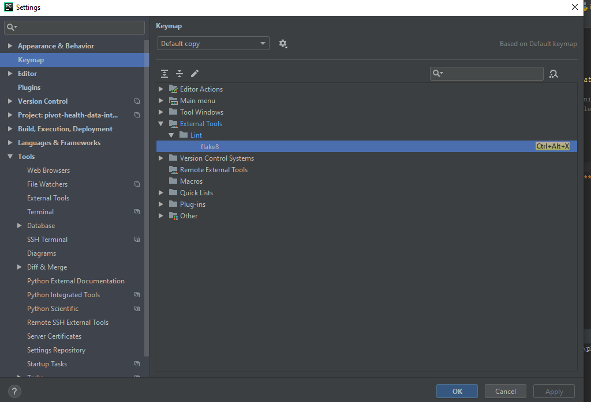
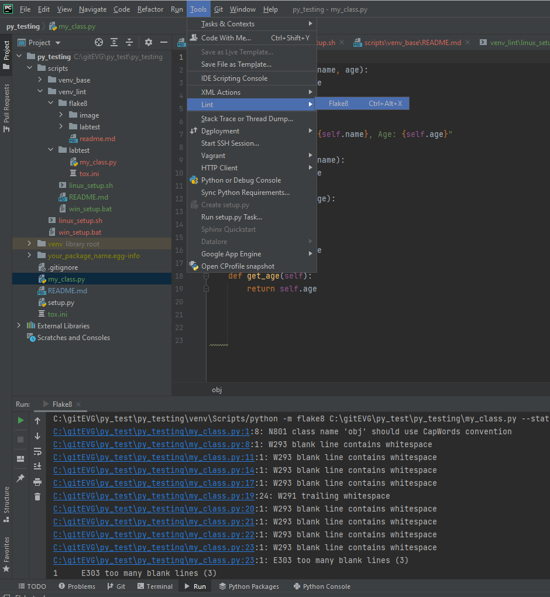

# Estilo de Código y Estandarización
El propósito de este documento es describir cómo integrar una herramienta de linting en nuestros repositorios para estandarizar el estilo de código
para todos los desarrolladores, para prevenir estilos de código desordenados y convenciones de nombres irregulares, reforzando la consistencia de estilo
entre todos los miembros del equipo.

## Flake8
Flake8 es una herramienta para reforzar el estilo de código en un proyecto. La idea central de esta herramienta es
proporcionar:

- Estándares de codificación
- Detección de errores
- Detección de refactorización
- Integración con IDE/Editor
- Extensibilidad
- Fácil integración con CI/CD

La configuración predeterminada de Flake8 incluye 3 tipos de validaciones:
- Verificaciones de lint proporcionadas por PyFlakes
- Verificaciones de estilo Pep-0008 proporcionadas por pyCodeStyle
- Verificación de complejidad McCabe proporcionada por McCabe Project

### Pep8
Pep8 es una Guía de Estilo para Código Python. Esta referencia proporciona convenciones de codificación y pautas
para mejorar la legibilidad de un código consistente.

Python pep8: https://www.python.org/dev/peps/pep-0008/

Referencias Pep8: https://pep8.readthedocs.io/en/release-1.7.x/intro.html

### Instalación
python -m pip install flake8

Instalación: https://flake8.readthedocs.io/en/latest/index.html#installation-guide

Configuración: https://flake8.readthedocs.io/en/latest/user/configuration.html

    Rutas de configuración:
        Global por usuario en Windows: C:\\Users\xxxxx/flake8 o ~/.config/flake8/
        Global en Linux: ~/flake8/
        Ruta de nivel superior del proyecto: tox.ini o setup.cfg

Se recomienda que los repositorios tengan una configuración de nivel superior por repositorio

### Uso
flake8 [parámetros] {[ruta|archivo]}

opciones de parámetros:

- **help:** muestra todas las opciones disponibles
- **version:** para validar plug-ins instalados
- **select:** detecta solo una lista específica de errores
- **count:** Totales de errores
- **diff:** verifica solo archivos modificados y esto debe configurarse en la línea de comandos
- **filename:** lista o patrón de todos los archivos a verificar, por defecto *.py
- **ignore:** excluye errores en la validación
- **exclude:** excluye archivos o patrones en una carpeta
- **statistics:** muestra el conteo de errores por tipo de error
- ... ver referencia o ayuda

       python -m flake8 entrypoint --statistics

### Lista de Errores
Como se mencionó anteriormente en este documento, PEP8 clasifica los errores según el tipo detectado, todos los errores se muestran
en una convención de prefijos

    E***: errores y advertencias pep8
    W***: errores y advertencias pep8
    F***: códigos PyFlakes
    C9**: plugin de complejidad McCabe
    N8**: plugin de Convenciones de Nombres pep8-naming

Pep8 E/W: https://pep8.readthedocs.io/en/release-1.7.x/intro.html#error-codes

pyflake: https://flake8.readthedocs.io/en/latest/user/error-codes.html

Pep8-Naming: https://github.com/PyCQA/pep8-naming

Lint: https://lintlyci.github.io/Flake8Rules/

### Configuración En el repositorio

    [flake8]
    exclude = .git
    ignore = E226,E302,E41,E203,W391,W292,W503
    max-line-length = 256

### Plugins

Puedes añadir nuevos plugins a tu instalación, para añadir uno nuevo usa pip install.

    busca en https://pypi.org/ y Busca flake8-xxxxx

    Ejemplo: pep8-naming
    https://github.com/PyCQA/pep8-naming

## Configuración del Entorno

Rama actual

    1. En el nivel superior del repositorio encontrarás un archivo de configuración: tox.ini
    2. Todo el proyecto ha sido refactorizado para cumplir con el estilo de código pep8

IDE PyCharm, pero puedes usar cualquier otro IDE que soporte plugins de flake8 o incluso usar la línea de comandos y pre-commit hooks

Agregar Flake8 como herramienta externa

1. Abre el menú **Archivo..Configuración** (ctrl+alt+s)
2. Selecciona y expande la sección Herramientas y elige herramienta externa **Herramientas..Herramientas** externas
3. Crea una entrada para un formulario de herramienta externa

        Nombre: Flake8
        Grupo: Lint
        Programa: $PyInterpreterDirectory$/python
        Argumentos: -m flake8 $FileDir$ --statistics
        Directorio de trabajo: $ProjectFileDir$

      

Agregar un atajo de teclado para usar la herramienta externa
1. Abre el menú **Archivo..Configuración** (ctrl+alt+s)
2. selecciona la opción de atajos de teclado
3. selecciona la carpeta de herramientas externas y expande hasta encontrar nuestro plugin creado y haz clic

      

4. selecciona la opción agregar teclado y escribe ctrl+alt+x

Ejecutar Flake8

    1. Haz clic en el archivo o carpeta que quieres probar
    2. presiona ctrl+alt+x, si todo está bien el programa debería retornar sin errores
    3. puedes ejecutar usando el menú contextual

   

Verificar errores y corregirlos

Después de ejecutar flake8 puedes verificarlo en la consola de tu IDE, los códigos de error describen el tipo de error pep8 y la línea y columna del archivo que lo produce

Refactorizar:

Es muy fácil corregir errores, para hacerlo el desarrollador necesita usar el reformateo de código o la herramienta de sugerencias
selecciona **menú..Código..Reformatear** CTR+Alt+L

# AutoFix:
Para auto-formatear y corregir automáticamente errores de estilo en Python, pueden usar autopep8 o black
en este caso estamos usaremos autopep

## Instalar autopep8
    pip install autopep8

## Para ver los cambios que se harían sin aplicarlos:
    autopep8 --diff archivo.py

## Para formatear un archivo:
    autopep8 --in-place archivo.py
    autopep8 --in-place --aggressive archivo.py

## Para formatear todos los archivos Python en un directorio:

    autopep8 --in-place --recursive .

Al igual que en el caso anterior agregarlo al ide es muy simple ... puedes agregarlo como parte del grupo como otro external tool

Plugins para Atributos, flakelint:

    pip install flake8-pylint
    pip install flake8-class-attributes-order

para hacer el test reemplazar el archivo tox_decorators.ini en el root folder
